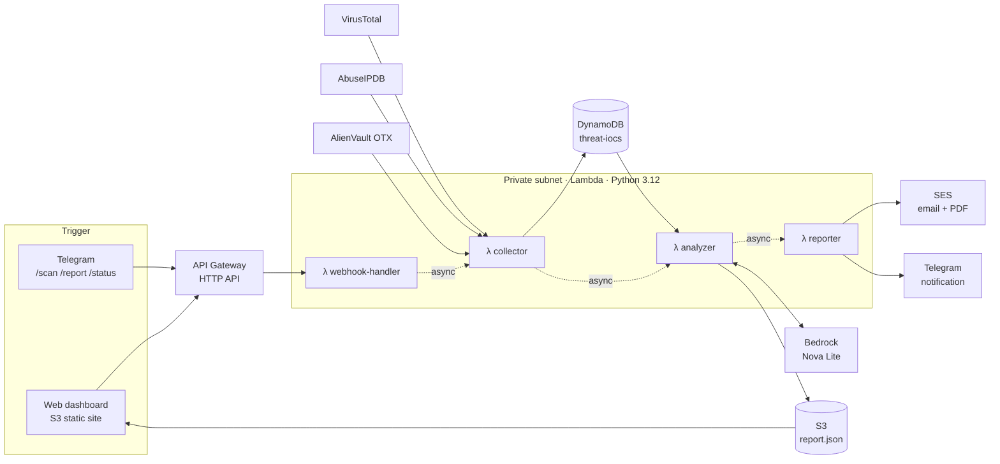

# AI-Powered Threat Intelligence Platform on AWS

> A serverless, event-driven pipeline that **collects** threat indicators from public feeds, **enriches** them with VirusTotal and MITRE ATT&CK, **analyzes** them with generative AI (Amazon Bedrock — Nova Lite), and **delivers** a SOC-ready PDF report by email, Telegram and a web dashboard.


---

## Table of contents

- [Why this project](#why-this-project)
- [At a glance](#at-a-glance)
- [Architecture](#architecture)
- [Pipeline components](#pipeline-components)
- [Threat intelligence sources](#threat-intelligence-sources)
- [MITRE ATT&CK mapping](#mitre-attck-mapping)
- [Data model](#data-model)
- [Security architecture](#security-architecture)
- [Cost](#cost)
- [Deployment](#deployment)
- [Engineering challenges](#engineering-challenges)
- [Roadmap](#roadmap)
- [Documentation](#documentation)
- [Author](#author)

---

## Why this project

Every morning, SOC analysts repeat the same routine: open several threat feeds, copy indicators, look each one up on VirusTotal, figure out what kind of attack it relates to, and write a summary for the team. It takes hours, and the result depends on who did it that day.

This platform automates the whole routine. Indicators of compromise (IOCs) are pulled from **AlienVault OTX** and **AbuseIPDB**, the most critical ones are confirmed on **VirusTotal**, each IOC is tagged with a **MITRE ATT&CK** technique, and **Amazon Nova Lite** writes the analyst summary. The result is a PDF report delivered where the team already works.

## At a glance

| | Manual process | With the platform |
|---|---|---|
| **Daily analysis time** | 3–4 hours | **< 5 minutes** |
| **IOC coverage** | 20–30, collected by hand | **99+ per run**, automated |
| **Enrichment** | Manual lookups | Automated VirusTotal + MITRE ATT&CK |
| **Report** | 1–2 hours of writing | Automatic PDF with charts and AI summary |
| **Delivery** | Ad hoc | Email (SES) + Telegram + web dashboard |

## Architecture


The platform runs entirely on managed AWS services in `us-east-1`. It is organized into four layers:



Each Lambda invokes the next one **asynchronously**, so no function waits for the rest of the pipeline. Each stage stays within its own timeout, and a slow external API in one stage doesn't block the caller.

## Pipeline components

### 1. `threat-webhook-handler` — entry point

Exposed through API Gateway. It receives commands from the web dashboard and the Telegram bot, and triggers the pipeline.

| Route | Method | Action |
|---|---|---|
| `/webhook` | POST | Handle Telegram commands (`/scan`, `/report`, `/status`) |
| `/scan` | POST | Start the pipeline from the web dashboard |
| `/report` | GET | Return the latest JSON report to the dashboard |
| `/status` | GET | Return system status |
| `/*` | OPTIONS | CORS preflight |

### 2. `threat-collector` — collect and enrich

1. Fetches IOCs from **AlienVault OTX** (top 5 subscribed pulses × 10 indicators).
2. Fetches malicious IPs from **AbuseIPDB** (confidence ≥ 90%, up to 50).
3. Enriches the **top 10 critical IOCs** on **VirusTotal** (malicious engine count, reputation).
4. Maps each IOC to a **MITRE ATT&CK** technique from keywords in its description.
5. Batch-writes everything to **DynamoDB**, then invokes the analyzer.

### 3. `threat-analyzer` — AI analysis

Reads the day's IOCs from DynamoDB, builds a structured security summary and sends it to **Amazon Nova Lite** through Bedrock. The AI analysis and the statistics are saved to S3 as `report.json`:

```json
{
  "date": "2026-07-25",
  "total_iocs": 99,
  "critical_count": 50,
  "top_countries": [["RU", 25], ["CN", 18]],
  "mitre_techniques": { "T1110": "Brute Force" },
  "analysis": "AI SOC report...",
  "analyzed_by": "Amazon Nova Lite"
}
```

### 4. `threat-reporter` — report and deliver

Generates a PDF with **fpdf2** and sends it by email through **SES**, with a summary notification on **Telegram**. The report contains:

- Header with date and AI model
- KPI cards: total IOCs, critical, high, VirusTotal-confirmed
- Full AI security analysis from Nova Lite
- Geographic distribution chart (top 8 countries)
- Severity distribution and MITRE ATT&CK table

## Threat intelligence sources

| Source | What is collected | Filtering | Free tier |
|---|---|---|---|
| **AlienVault OTX** | IOCs from subscribed pulses (IPs, domains, URLs, hashes) | Top 5 pulses × 10 indicators | Free |
| **AbuseIPDB** | Blacklisted IP addresses | Confidence ≥ 90%, limit 50 | 1,000 requests/day |
| **VirusTotal** | Confirmation of the most critical IOCs | Top 10 critical IOCs, 0.5 s between requests | 500 requests/day |

Severity rules for AbuseIPDB: confidence **≥ 95% → CRITICAL**, **90–94% → HIGH**.

## MITRE ATT&CK mapping

Each IOC is assigned a technique based on keywords found in its description:

| Keyword | Technique ID | Technique |
|---|---|---|
| botnet | T1583.001 | Acquire Infrastructure: Botnet |
| scanner | T1595 | Active Scanning |
| bruteforce | T1110 | Brute Force |
| malware | T1204 | User Execution: Malicious File |
| phishing | T1566 | Phishing |
| c2 | T1071 | Application Layer Protocol |
| ransomware | T1486 | Data Encrypted for Impact |
| tor | T1090.003 | Proxy: Multi-hop Proxy |
| *(no match)* | T1078 | Valid Accounts |

> This is a deliberately simple, rule-based mapping: it is fast, free and explainable. It is also the main accuracy limit of the platform. An IOC with no matching keyword falls back to a default technique, so the ATT&CK distribution in the report should be read as an indication, not ground truth.

## Data model

DynamoDB table **`threat-iocs`**:

| Attribute | Type | Description |
|---|---|---|
| `ioc_value` **(PK)** | String | The indicator (IP, domain, URL, hash) |
| `source` **(SK)** | String | AlienVault or AbuseIPDB |
| `type` | String | IP, domain, URL, FileHash |
| `severity` | String | CRITICAL or HIGH |
| `country` | String | ISO 3166-1 alpha-2 code |
| `date` | String | Collection timestamp (ISO 8601) |
| `mitre_technique_id` | String | e.g. `T1110` |
| `mitre_technique_name` | String | e.g. `Brute Force` |
| `vt_malicious` | Number | VirusTotal engines flagging the IOC |
| `vt_enriched` | Boolean | Whether VirusTotal enrichment was performed |

Using `ioc_value` + `source` as the key means the same indicator reported by two feeds is kept as two records, so you can see which source reported it.

## Security architecture

### Network isolation

All four Lambda functions run in a **private subnet with no public IP**. AWS services are reached through **VPC endpoints**; the external APIs (feeds, VirusTotal, Telegram) are reached through a **NAT Gateway**. The security group allows **outbound HTTPS (443) only**.

| Component | Value | Purpose |
|---|---|---|
| VPC `threat-intel-vpc` | `10.0.0.0/16` | Isolated network boundary |
| Public subnet | `10.0.1.0/24` | NAT Gateway |
| Private subnet | `10.0.2.0/24` | Lambda functions |

| VPC endpoint | Type | Purpose |
|---|---|---|
| Amazon S3 | Gateway | Private access to reports (free) |
| Amazon DynamoDB | Gateway | Private access to IOCs (free) |
| AWS Secrets Manager | Interface | Secret retrieval without leaving the VPC |
| Amazon Bedrock Runtime | Interface | Private model invocation |

### Secrets management

No API key lives in the code or in Lambda environment variables. Everything is stored in a single Secrets Manager secret, **`threat-intel/config`**, read at runtime:

`OTX_API_KEY` · `ABUSEIPDB_API_KEY` · `VIRUSTOTAL_API_KEY` · `TELEGRAM_BOT_TOKEN` · `TELEGRAM_CHAT_ID` · `S3_BUCKET` · `SES_SENDER_EMAIL` · `SES_RECIPIENT_EMAIL`

### IAM

All functions share the role **`threat-lambda-role`**, built from AWS-managed policies (Lambda basic + VPC execution, DynamoDB, S3, Bedrock, SES, Secrets Manager, Lambda invoke). Replacing these broad managed policies with scoped inline policies is on the [roadmap](#roadmap).

## Cost

| Service | Usage | Monthly cost |
|---|---|---|
| Lambda (4 functions) | 30 runs/month | $0.00 (Free Tier) |
| DynamoDB | ~3,000 IOCs/month | $0.00 (Free Tier) |
| S3 (2 buckets) | < 1 GB | $0.00 (Free Tier) |
| API Gateway | < 1M requests | $0.00 (Free Tier) |
| SES | 30 emails | $0.00 (Free Tier) |
| CloudWatch | Basic metrics and logs | $0.00 (Free Tier) |
| Bedrock Nova Lite | 30 analyses × ~2K tokens | ~$0.01 |
| Secrets Manager | 1 secret | ~$0.30 |
| **NAT Gateway** | 730 h + data transfer | **~$32.00** |
| **VPC interface endpoints** | 2 × 730 h | **~$14.00** |
| **Total** | | **~$46/month** |

The pipeline itself (compute, storage and AI) costs **about $0.30/month**. Around 99% of the bill comes from the network isolation layer, which is billed by the hour whether the pipeline runs or not. That is a deliberate trade-off: security over cost. For a non-production setup, running the Lambdas outside the VPC removes the NAT Gateway and interface endpoints, and brings the total under $1/month.

## Deployment

### Prerequisites

- An AWS account with Bedrock access to **Amazon Nova Lite** enabled in `us-east-1`
- API keys for AlienVault OTX, AbuseIPDB and VirusTotal
- A Telegram bot token from [@BotFather](https://t.me/BotFather) and your chat ID
- A verified sender address in Amazon SES

### 1. Network

1. Create the VPC `10.0.0.0/16` with a public subnet `10.0.1.0/24` and a private subnet `10.0.2.0/24`.
2. Create a NAT Gateway (with an Elastic IP) in the public subnet, and add a route `0.0.0.0/0 → NAT Gateway` to the private subnet's route table.
3. Create a security group `threat-intel-lambda-sg` allowing outbound HTTPS (443) only.
4. Create the VPC endpoints: S3 and DynamoDB (Gateway), Secrets Manager and Bedrock Runtime (Interface).

### 2. Data and secrets

1. Create the DynamoDB table `threat-iocs` (partition key `ioc_value`, sort key `source`).
2. Create the S3 buckets for reports and for the web dashboard.
3. Create the secret `threat-intel/config` with the keys listed in [Secrets management](#secrets-management).

### 3. Lambda functions

The reporter needs `fpdf2`, which isn't included in the Lambda runtime. Package it as a Lambda layer, for example from CloudShell:

```bash
# Install fpdf2 into a "python/" folder — the path Lambda layers expect
pip install fpdf2 --target python/
# Zip it, then publish the archive as a Lambda layer
zip -r layer.zip python/
```

Then deploy the four functions with the **Python 3.12** runtime, attach them to the private subnet with `threat-intel-lambda-sg`, and attach the `fpdf2` layer to `threat-reporter`.

| Function | Timeout |
|---|---|
| `threat-webhook-handler` | 5 min |
| `threat-collector` | 5 min |
| `threat-analyzer` | 3 min |
| `threat-reporter` | 3 min |

### 4. API and dashboard

1. Create an HTTP API in API Gateway with CORS enabled and the routes listed in [Pipeline components](#1-threat-webhook-handler--entry-point).
2. Register the Telegram webhook at `{API_URL}/webhook`.
3. Set the API URL in `index.html` and upload it to the dashboard bucket as a static website.

## Engineering challenges

- **Bedrock content filtering.** Nova Lite blocked some analyses because the prompt contained raw malicious indicators and attack vocabulary. Rewording the prompt as a defensive SOC task — summarize these threats for an analyst — made the analysis go through.
- **Unicode in PDF generation.** fpdf2's built-in fonts only support latin-1, and feed descriptions contain characters outside it, which crashed report generation. A `safe_text()` helper now normalizes all text to latin-1 before it is written to the PDF.
- **VPC routing.** Lambdas deployed in the wrong VPC could reach neither the endpoints nor the internet, so calls failed with timeouts rather than clear errors. Fixing the placement and the private subnet's route to the NAT Gateway resolved it.

## Roadmap

- [ ] **EventBridge schedule** for an automatic daily run at 06:00 UTC (today the pipeline is triggered on demand)
- [ ] **Scoped IAM policies** per function instead of shared AWS-managed policies
- [ ] **Infrastructure as Code** with Terraform
- [ ] **DynamoDB Streams** for real-time alerts on critical IOCs
- [ ] More feeds: Shodan, PhishTank, URLhaus
- [ ] **STIX/TAXII export** for SIEM integration
- [ ] ML-based threat scoring on Amazon SageMaker

## Documentation

The full technical documentation is available in [`threat_intel_doc_aws_project.pdf`](./threat_intel_doc_aws_project.pdf).

## Author

**Ayoub ELMORTAJI** — Engineering student in Cybersecurity & Cloud Computing, ENSAM Casablanca

[GitHub](https://github.com/AyoubElmortaji)
